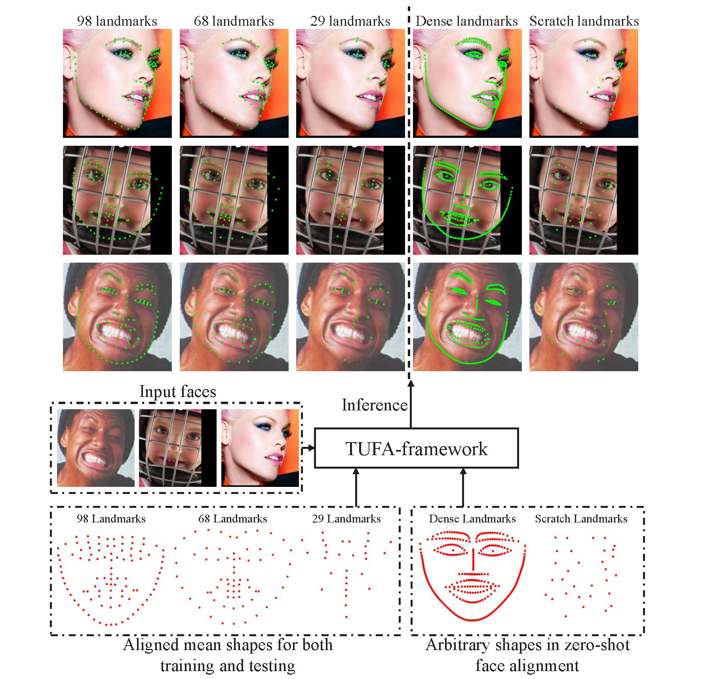
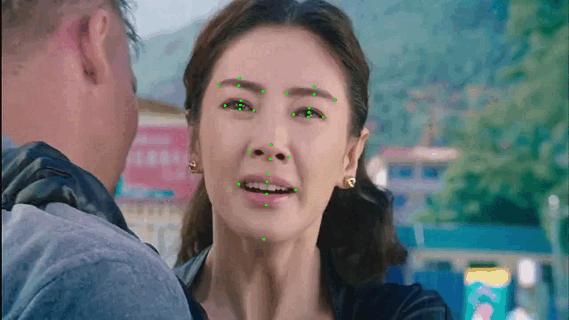
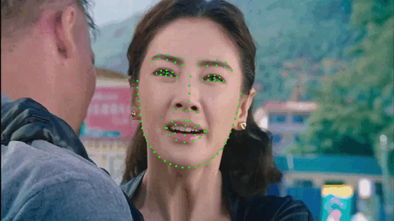
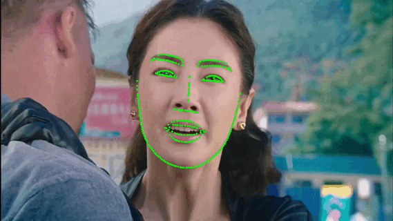

# Task-agnostic Unified Face Alignment (TUFA)
PyTorch _evaluation_ code and pretrained models for **TUFA** (Task-agnostic Unified Face Alignment).



TUFA is a novel face alignment method that mitigates 
the knowledge discrepancy between different datasets 
using facial structure prompts and semantic alignment 
embeddings. As a result, it can maximize the use of 
multiple datasets to train a unified model. 
This unified model can predict an arbitrary number 
of landmarks, even those never seen during training.






## Installation
#### Note: this released version was tested on Python3.8, Pytorch 1.8 and Windows 10.

Install python dependencies:
```
pip3 install -r requirements.txt
```

## Run Evaluation on WFLW, 300W, COFW datasets
1. Download and process WFLW, 300W,  dataset
    * Download WFLW dataset and annotation from [Here](https://wywu.github.io/projects/LAB/WFLW.html).
    * Download 300W dataset and annotation from [Here](https://ibug.doc.ic.ac.uk/resources/300-W/#:~:text=Automatic%20facial%20landmark%20detection%20is%20a).
    * Download COFW dataset and annotation from [Here](https://data.caltech.edu/records/bc0bf-nc666#:~:text=A%20novel%20face%20dataset%20focused%20on).
    * Unzip these three datasets and annotations and move files into ```./Data``` directory. Your directory should look like this:
        ```
        TUFA
        └───Data
           │
           └───WFLW
           │  │
           │  └───WFLW_annotations
           │  │   └───list_98pt_rect_attr_train_test
           │  │   │
           │  │   └───list_98pt_test
           │  └───WFLW_images
           │      └───0--Parade
           │      │
           │      └───...
           └───300W
           │  │  
           │  └───train_list.txt
           │  └───test_list.txt      
           │  └───ibug     
           │  └───lfpw    
           │  └───...  
           └───COFW
              │ 
              └───train_list.txt
              └───test_list.txt
              └───testset
                  └───0.jpg
                  └───0.npz
        ```
#### Note: we use npz file to record the landmark coordinates of the corresponding face in COFW. Its size should be 29 × 2.

2. Download pretrained model from [Google Drive](https://drive.google.com/file/d/1rRAB3W74QK-J6W_EnjC7HhS-zjT9BuED/view?usp=sharing).
    <table>
      <thead>
        <tr style="text-align: right;">
          <td>Dataset</td>
          <td>WFLW</td>
          <td>300W</td>
          <td>COFW</td>
        </tr>
      </thead>
      <tbody>
        <tr>
          <td>NME (%)</td>
          <td>3.93</td>
          <td>2.95</td>
          <td>3.07</td>
        </tr>
        <tr>
          <td>FR<sub>0.1</sub> (%)</td>
          <td>1.52</td>
          <td>0.00</td>
          <td>0.02</td>
        </tr>
      </tbody>
    </table>
   
    Put the model in ```./Weights``` directory.

3. Test
    ```
    python Test.py --dataset=<dataset_nane>
    WFLW: python Test.py --dataset=WFLW
    300W: python Test.py --dataset=300W
    COFW: python Test.py --dataset=COFW
    ```
#### Note: We achieve SOTA performance on multiple datasets using only one unified model.

## Video Demo

We also provide a video demo script.
1. Download face detector [yunet_n_640_640.onnx](https://github.com/ShiqiYu/libfacedetection.train/tree/master/onnx), copy the weight 
```yunet_n_640_640.onnx``` to ```Weights```
2. ```python Camera.py --video_source=<Video Path> --points_numbe=314```
#### We provide the prompts for 29, 68, 98 and 314 landmarks prediction.

## Citation
If you find this work or code is helpful in your research, please cite:
```
@inproceedings{TUFA,
  title={Mitigating Knowledge Discrepancies among Multiple Datasets for Task-agnostic Unified Face Alignment},
  author={Jiahao Xia and Min Xu and Wenjian Huang and Jianguo Zhang and Haimin Zhang and Chunxia Xiao},
  booktitle={IJCV},
  year={2025}
}
```

## License
TUFA is released under the GPL-2.0 license. Please see the [LICENSE](LICENSE) file for more information.

## Acknowledgments
   * This repository borrows or partially modifies the models from [DETR](https://github.com/facebookresearch/detr)
   * The video demo employs the [libfacedetection](https://github.com/ShiqiYu/libfacedetection.train) as the face detector.
   * The test videos are provided by [DFEW](https://dfew-dataset.github.io/)
